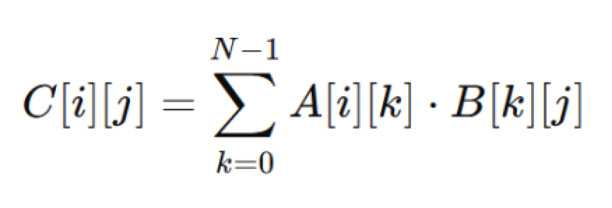

# Project 1. Algorithmic Optimization and Custom Instruction Proposal

## 1. Introduction

This project demonstrates the benefits of **hardware-software co-design** by optimizing a general matrix multiplication (GEMM) kernel and proposing a custom instruction to support it. The optimization strategy addresses **large-strided memory accesses** through matrix transposition, and introduces a custom **dual multiply-accumulate (dmac)** instruction that performs two 32-bit MAC operations in parallel using a single 64-bit instruction. We evaluate both the software optimization and hardware instruction proposal using the **gem5 simulator** with atomic and timing CPU models.

<p align="center"></p>

## 2. Usage

```bash
make
$ python3 run_atomic.py
$ python3 run_timing.py
$ ... (gem5 commands)
```

## 3. gem5 Results

### 3.1. Baseline Characterization

Baseline results for the original GEMM implementation without any optimizations:

| **N** | **64** | **128** | **256** | **64** | **128** | **256** |
|---|---:|---:|---:|---:|---:|---:|
| **CPU Model** | atomic | atomic | atomic | timing | timing | timing |
| **simTicks** | 2,914,252,500 | 17,942,504,500 | 136,773,404,000 | 38,238,680,00 | 69,265,981,500 | 683,919,361,000 |
| **simInsts** | 5,016,785 | 31,255,470 | 238,966,623 | 5,016,800 | 31,249,448 | 238,966,803 |
| **Correctness** | yes | yes | yes | yes | yes | yes |

### 3.2. Optimized Results (with Transposition + dmac)

Results for the optimized GEMM with matrix transposition and custom dmac instruction:

| **N** | **64** | **128** | **256** | **64** | **128** | **256** |
|---|---:|---:|---:|---:|---:|---:|
| **CPU Model** | atomic | atomic | atomic | timing | timing | timing |
| **simTicks** | 2,898,054,000 | 17,127,116,000 | 129,089,210,000 | 36,918,835,00 | 44,493,625,000 | 414,406,519,500 |
| **simInsts** | 4,672,287 | 28,317,996 | 214,643,741 | 4,672,086 | 28,318,256 | 214,643,845 |
| **Correctness** | yes | yes | yes | yes | yes | yes |

### 3.3. Performance Summary

| **Metric** | **N=64** | **N=128** | **N=256** |
|---|---:|---:|---:|
| **Atomic simTicks Improvement** | 0.6% | 4.6% | 5.7% |
| **Timing simTicks Improvement** | 3.4% | 35.8% | 39.4% |
| **Average simInsts Reduction** | 7.1% | 9.4% | 10.3% |

**Key Observation**: Performance improvements are more significant on the **timing CPU model**, as the optimization primarily targets data movement and memory access patterns rather than raw instruction count. The atomic model masks these benefits since it assumes single-cycle memory accesses.

## 4. Optimization Strategy

### 4.1. Problem Identification

The baseline GEMM implementation suffers from **large-strided memory accesses** in the innermost loop when accessing matrix B (columns). This creates poor cache locality and undermines the small working set goal for pipelined processors.

### 4.2. Software Optimization: Matrix Transposition

To transform strided column accesses into contiguous row accesses, we transpose matrix B before the main computation loop. While this introduces an $O(N^2)$ cost upfront, it quickly becomes worthwhile as N grows, significantly reducing the $O(N^3)$ loop's memory pressure.

**Implementation Strategy**:
- Pre-compute the transposed matrix B
- Transform large-strided accesses into contiguous memory patterns
- Improve cache utilization in the inner $O(N^3)$ loop

### 4.3. Hardware Optimization: Custom dmac Instruction

**Instruction Specification**:
```
dmac $rd, $rs1, $rs2
```

- **Operands**: Each register holds 2× int32_t values packed in a 64-bit register (*SWAR: SIMD Within A Register*)
- **Pseudocode**: `$rd = $rs1[63:32] × $rs2[63:32] + $rs1[31:0] × $rs2[31:0]`
- **Replaces**: 4 loads + 2 multiplications + 1 addition ⟹ 2 loads + 1 dmac
- **Encoding**: R-type-like format for register-register arithmetic

**Expected Benefits**:
- Utilizes full 64-bit ISA bandwidth (previously wasted on 32-bit operands)
- Enables two MAC operations per instruction
- Breaks instruction-level parallelism bottlenecks in multiply-accumulate chains

**Hardware Requirements**:
- One additional 32-bit multiplier (alongside the existing ALU multiplier)
- One additional adder to combine the two products
- New control signal to select between ALU result and dual-product result

## 5. Design

### 5.1. Baseline GEMM

```cpp
void gemm_baseline(const std::vector<int32_t>& A,
                   const std::vector<int32_t>& B,
                   std::vector<int32_t>& C,
                   int N) {
    for (int i = 0; i < N; ++i) {
        for (int j = 0; j < N; ++j) {
            int32_t sum = 0;
            for (int k = 0; k < N; ++k) {
                sum += A[idx(i, k, N)] * B[idx(k, j, N)];
            }
            C[idx(i, j, N)] = sum;
        }
    }
}
```

The baseline uses traditional row-major matrix multiplication. Each element C[i][j] is computed by accumulating the dot product of row i of A and column j of B. This creates large-strided memory accesses to B that harm cache locality.

### 5.2. Optimized GEMM with Transposition and SWAR

The optimized version (**gemm_approx**) uses three key techniques:

**Step 1: Padding for Even Dimensions**
```cpp
int padded_N = (N + 1) & ~1;  // Round up to next even number
std::vector<int32_t> pad_A(padded_N * padded_N, 0);
std::vector<int32_t> pad_B(padded_N * padded_N, 0);
std::vector<int32_t> pad_BT(padded_N * padded_N, 0);

// Copy original data into padded buffers
for (int i = 0; i < N; ++i) {
    for (int j = 0; j < N; ++j) {
        pad_A[idx(i, j, padded_N)] = A[idx(i, j, N)];
        pad_B[idx(i, j, padded_N)] = B[idx(i, j, N)];
    }
}
```

**Step 2: Matrix Transposition with SWAR (SIMD Within A Register)**

The transposition processes 2×2 blocks using 64-bit loads/stores to maximize bandwidth:

```cpp
for (int i = 0; i < padded_N; i += 2) {
    for (int j = 0; j < padded_N; j += 2) {
        // Load 2×2 block from B as two 64-bit values
        uint64_t r0 = *reinterpret_cast<const uint64_t*>(&pad_B[idx(i,     j, padded_N)]);
        uint64_t r1 = *reinterpret_cast<const uint64_t*>(&pad_B[idx(i + 1, j, padded_N)]);

        // Transpose using bit manipulation
        uint64_t out0 = (r0 & 0xFFFFFFFF) | (r1 << 32);
        uint64_t out1 = (r0 >> 32)        | (r1 & 0xFFFFFFFF00000000);

        // Write transposed 2×2 block to BT
        *reinterpret_cast<uint64_t*>(&pad_BT[idx(j,     i, padded_N)]) = out0;
        *reinterpret_cast<uint64_t*>(&pad_BT[idx(j + 1, i, padded_N)]) = out1;
    }
}
```

**Step 3: Main Multiplication with dmac Approximation**

The inner loop processes two elements at a time using 64-bit loads, approximating the dmac instruction:

```cpp
for (int i = 0; i < N; ++i) {
    int32_t row_offset_padded = i * padded_N;
    int32_t row_offset_original = i * N;
    
    for (int j = 0; j < N; ++j) {
        int32_t sum = 0;
        int32_t A_offset = row_offset_padded;
        int32_t B_offset = j * padded_N;

        // Process 2 elements per iteration
        for (int k = 0; k < padded_N; k += 2) {
            // Load two 32-bit values from A and BT as 64-bit
            uint64_t valA = *reinterpret_cast<const uint64_t*>(&pad_A[A_offset]);
            uint64_t valB = *reinterpret_cast<const uint64_t*>(&pad_BT[B_offset]);

            // Extract individual 32-bit elements
            int32_t a0 = static_cast<int32_t>(valA & 0xFFFFFFFF);
            int32_t a1 = static_cast<int32_t>(valA >> 32);
            int32_t b0 = static_cast<int32_t>(valB & 0xFFFFFFFF);
            int32_t b1 = static_cast<int32_t>(valB >> 32);

            // Dual multiply-accumulate (dmac approximation)
            sum += (a0 * b0) + (a1 * b1);

            A_offset += 2;
            B_offset += 2;
        }
        
        C[row_offset_original + j] = sum;
    }
}
```

### 5.3. Key Design Decisions

**Padding Strategy**: Rounding N up to the nearest even number (using bitwise AND: `(N + 1) & ~1`) allows the SWAR loops to process all elements without special-casing the last row/column when N is odd.

**SWAR Transposition**: Processing 2×2 blocks with 64-bit loads/stores is more cache-efficient than element-by-element transposition. The bit manipulation (`out0 = (r0 & 0xFFFFFFFF) | (r1 << 32)`) performs the actual in-register transpose.

**64-bit Processing in Inner Loop**: Loading pairs of int32_t values as uint64_t and extracting them via bit shifts and masking directly approximates what a hardware dmac instruction would do—processing two multiplications in parallel with a single instruction.

**Padding-Based Loop Design**: Using loop padding (processing padded elements as zeros) rather than loop peeling (separate scalar remainder loop) reduces branch misprediction penalties and keeps the inner loop uniform.

## 6. Discussion

### Why optimize GEMM?

Matrix multiplication dominates many scientific computing workloads, and improving even small kernels can yield significant overall system improvements.

### Why focus on memory access patterns?

The baseline implementation's large-strided accesses to matrix B cause poor cache locality. The $O(N^2)$ transposition cost is amortized over the $O(N^3)$ main loop—especially important for larger matrices where the working set exceeds cache capacity.

### Why propose the dmac instruction?

1. The operands in GEMM are naturally 32-bit values, wasting 64-bit bandwidth
2. MAC operations dominate the inner loop
3. A dual-MAC instruction enables two multiplications per instruction, breaking ILP bottlenecks

### Performance Analysis

- **Atomic CPU**: Improvements are modest (~0.6–5.7%) because atomic memory accesses hide the cost of large strides
- **Timing CPU**: Improvements are substantial (~3.4–39.4%) because the pipelined architecture better reflects real cache dynamics and instruction dependencies

The larger improvements at higher N values validate our hypothesis that the transposition cost is worthwhile for larger working sets.

## 7. Conclusion

This project demonstrates the power of **hardware-software co-design**:

1. **Software optimization** (transposition) transforms an algorithmic bottleneck into an opportunity
2. **Hardware support** (dmac instruction) addresses the instruction-level parallelism bottleneck in multiply-accumulate chains
3. **Combined benefits** justify the modest hardware complexity with measurable performance gains—potentially doubling execution throughput for GEMM-like kernels

The results validate that systematic co-design starting with the algorithm, followed by architecture-aware optimization and custom instruction proposals, can deliver significant improvements even for well-studied computational kernels.