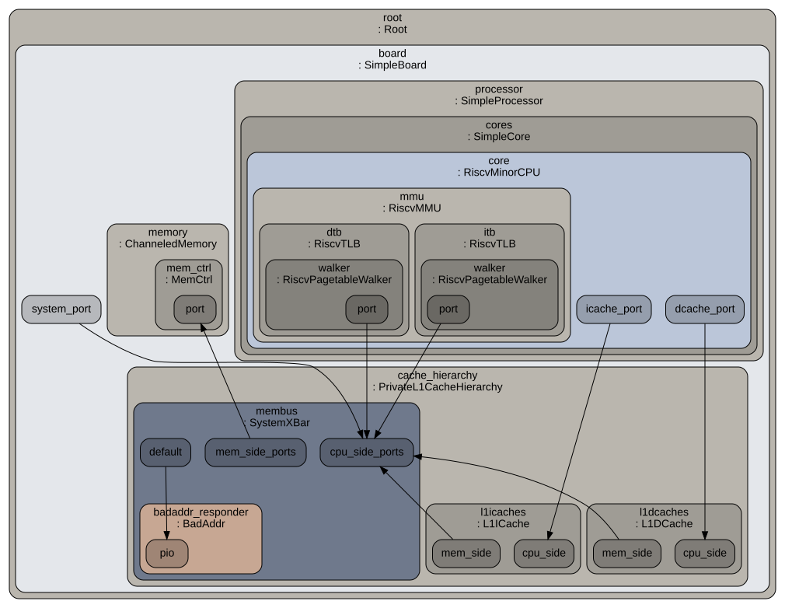

# Project 3. Memory-System-Aware GEMM

## 1. Quick Start

``` bash
$ python3 run_all_template.sh
```

## 2. GEMM Optimization

## Baseline

``` cpp
void gemm_baseline(const std::vector<int32_t>& A,
                   const std::vector<int32_t>& B,
                   std::vector<int32_t>& C,
                   int N) {
    for (int i = 0; i < N; ++i) {
        int row_base = i * N;
        for (int j = 0; j < N; ++j) {
            int32_t sum = 0;
            for (int k = 0; k < N; ++k) {
                sum += A[row_base + k] * B[k * N + j];
            }
            C[row_base + j] = sum;
        }
    }
}
```

## Transposing B

``` cpp
void gemm_transpose_b(const std::vector<int32_t>& A,
                      const std::vector<int32_t>& B,
                      std::vector<int32_t>& C,
                      int N) {
    std::vector<int32_t> BT(N * N);
    transpose_matrix(B, BT, N);

    for (int i = 0; i < N; ++i) {
        int row_base = i * N;
        for (int j = 0; j < N; ++j) {
            int col_base = j * N;
            int32_t sum = 0;
            for (int k = 0; k < N; ++k) {
                sum += A[row_base + k] * BT[col_base + k];
            }
            C[row_base + j] = sum;
        }
    }
}
```

- Pay a $O(N^2)$ transposition overhead, and access to B is streaming in the main $O(N^3)$ loop.

## Keeping Matrix A Stationary

``` cpp
void gemm_ikj_stream(const std::vector<int32_t>& A,
                     const std::vector<int32_t>& B,
                     std::vector<int32_t>& C,
                     int N) {
    zero_matrix(C);

    for (int i = 0; i < N; ++i) {
        int AC_base = i * N;
        for (int k = 0; k < N; ++k) {
            int32_t input_stationary = A[idx(i, k, N)];
            int B_base = k * N;
            for (int j = 0; j < N; ++j) {
                C[AC_base + j] += input_stationary * B[B_base + j];
            }
        }
    }
}
```

- Keeping A input stationary instead of transposing A matrix at function entry.

## 3. System Under Simulation

### TimingSimple CPU

- timing-aware simplified model

<p align="center"></p>

### Minor CPU

- a more structured in-order pipelined model

<p align="center"></p>

## 4. Result

### Baseline Run

| N | version | l1-d$ | CPU | simTicks | simInsts | overallMissRate::total | overallMissLatency::total |
|---|---------|-------|-----|----------|----------|------------------------|---------------------------|
| 64 | baseline | 32 | MinorCPU | 2,734,754,500 | 5,010,119 | 0.003652 | 182,332,000 |
| 64 | baseline | 32 | TimingSimpleCPU | 3,800,656,500 | 5,009,918 | 0.002292 | 136,260,000 |
| 128 | baseline | 32 | MinorCPU | 65,338,063,000 | 31,249,514 | 0.469769 | 56,987,763,500 |
| 128 | baseline | 32 | TimingSimpleCPU | 69,157,122,500 | 31,249,582 | 0.256462 | 47,864,004,500 |
| 256 | baseline | 32 | MinorCPU | 657,678,296,000 | 238,960,048 | 0.498250 | 605,203,944,000 |
| 256 | baseline | 32 | TimingSimpleCPU | 683,891,383,000 | 238,959,968 | 0.266554 | 522,116,775,000 |

### Memory System-aware Optimizations

| N | version | l1-d$ | CPU | simTicks | simInsts | overallMissRate::total | overallMissLatency::total |
|---|---------|-------|-----|----------|----------|------------------------|---------------------------|
| 64 | transpose_b | 32 | MinorCPU | 2,749,699,000 | 5,026,126 | 0.004257 | 195,799,500 |
| 64 | transpose_b | 32 | TimingSimpleCPU | 3,822,554,500 | 5,025,967 | 0.002606 | 147,317,500 |
| 128 | transpose_b | 32 | MinorCPU | 41,147,790,000 | 31,309,383 | 0.237737 | 29,482,945,500 |
| 128 | transpose_b | 32 | TimingSimpleCPU | 46,380,657,500 | 31,310,524 | 0.130004 | 24,490,079,500 |
| 256 | transpose_b | 32 | MinorCPU | 392,057,365,500 | 239,199,687 | 0.250667 | 307,786,006,500 |
| 256 | transpose_b | 32 | TimingSimpleCPU | 430,282,279,500 | 239,199,828 | 0.134366 | 263,856,654,500 |
| 64 | ikj_stream | 32 | MinorCPU | 2,744,670,000 | 5,258,585 | 0.003378 | 188,834,000 |
| 64 | ikj_stream | 32 | TimingSimpleCPU | 4,318,322,500 | 5,258,367 | 0.002024 | 139,767,000 |
| 128 | ikj_stream | 32 | MinorCPU | 40,995,760,500 | 33,290,221 | 0.190810 | 28,930,094,500 |
| 128 | ikj_stream | 32 | TimingSimpleCPU | 50,224,064,000 | 33,291,458 | 0.103904 | 24,214,592,500 |
| 256 | ikj_stream | 32 | MinorCPU | 391,131,919,500 | 255,515,418 | 0.200533 | 305,020,970,500 |
| 256 | ikj_stream | 32 | TimingSimpleCPU | 462,310,251,000 | 255,515,719 | 0.107192 | 262,626,242,500 |

### Sensitivity

| N | version | l1-d$ | CPU | simTicks | simInsts | overallMissRate::total | overallMissLatency::total |
|---|---------|-------|-----|----------|----------|------------------------|---------------------------|
| 128 | baseline | 16 | TimingSimpleCPU | 69,217,073,500 | 31,249,626 | 0.256074 | 47,922,055,500 |
| 128 | baseline | 32 | TimingSimpleCPU | 69,157,122,500 | 31,249,582 | 0.256462 | 47,864,004,500 |
| 128 | baseline | 64 | TimingSimpleCPU | 40,135,234,500 | 31,249,620 | 0.042862 | 17,902,738,000 |
| 128 | transpose_b | 16 | TimingSimpleCPU | 46,410,222,500 | 31,310,546 | 0.129836 | 24,518,735,000 |
| 128 | transpose_b | 32 | TimingSimpleCPU | 46,380,657,500 | 31,310,524 | 0.130004 | 24,490,079,500 |
| 128 | transpose_b | 64 | TimingSimpleCPU | 31,559,084,000 | 31,310,525 | 0.021787 | 9,190,697,000 |

## 5. Conclusion

- Both `gemm_transpose_b` and `gemm_ikj_stream` benefit around 35% when N = 256, while the benefit is insignificant when N = 64, 128.
- `gemm_transpose_b` has slightly better performance than the `gemm_ikj_stream` version according to the Gem5 simulation result.
